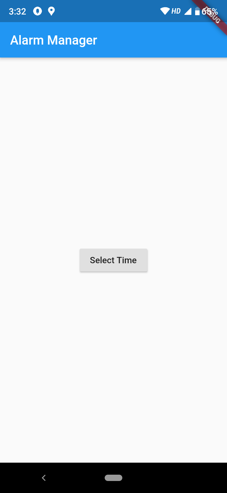
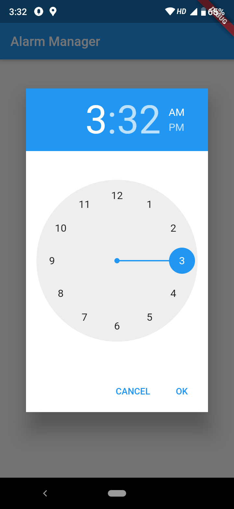
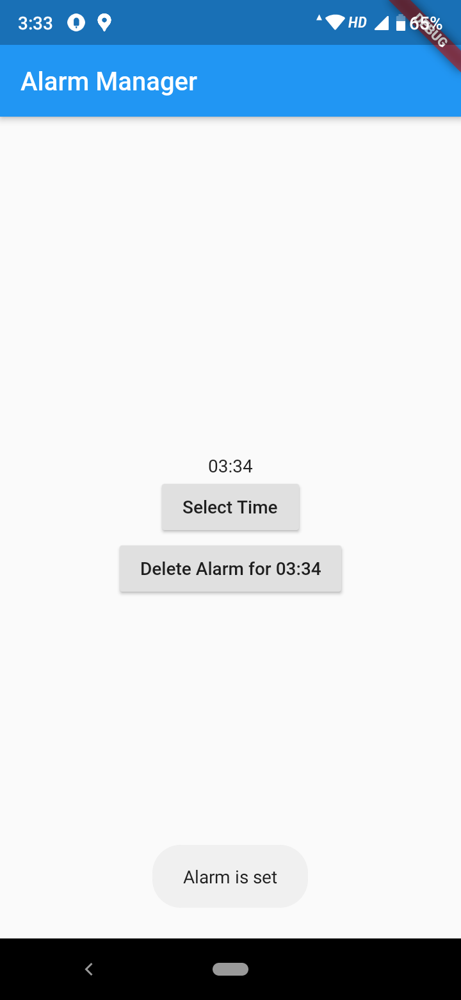
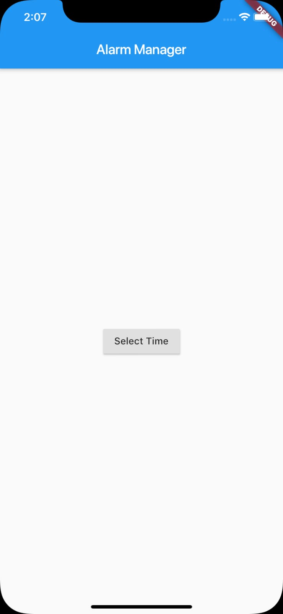
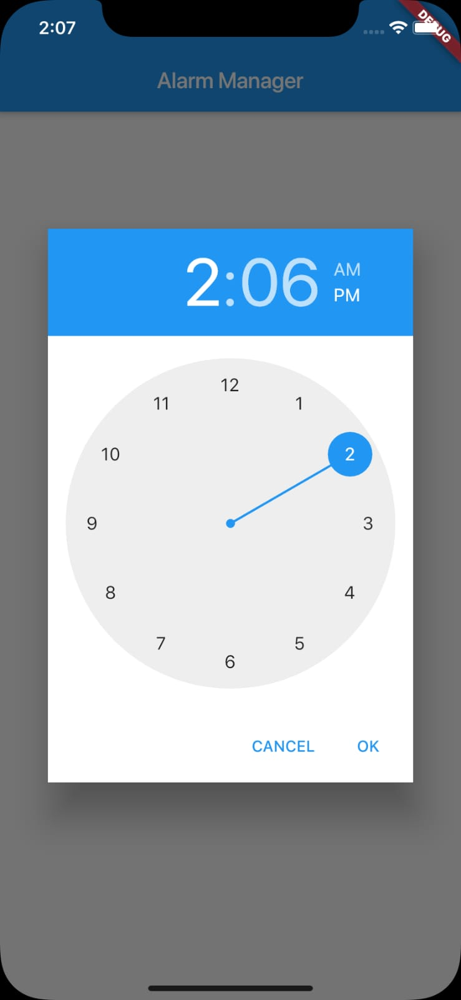
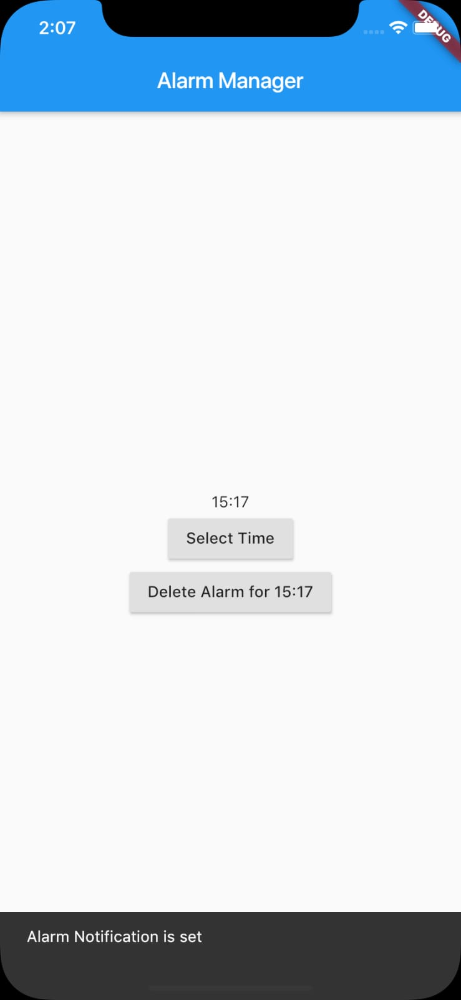

# demo_alarm_manager

A Sample flutter Application that fires an alarm.

### Implementation

This app uses Method Channels to communicate to the native code (kotlin) for andriod.

Flutter side
```dart
// This the method channel in flutter side to set an alarm
 void startAlarmService(BuildContext context) async {
    var methodChannel = MethodChannel("cheeseball.demo_alarm_manager");
    String data =
    await methodChannel.invokeMethod(
        "startAlarm", [timeInMillies, _hour, _minute]);
    debugPrint(data);
    showToast(context, data);
  }
  
  //This is method channel in flutter side to delete an alarm
   void deleteAlarm(BuildContext context) async {
      var methodChannel = MethodChannel("cheeseball.demo_alarm_manager");
      String data = await methodChannel.invokeMethod("deleteAlarm");
      debugPrint(data);
      showToast(context, data);
    }
  ```
  Android side
  ```kotlin
  class MainActivity : FlutterActivity() {
      private lateinit var alarmManager: AlarmManager
      private lateinit var intentAlarm: Intent
      private lateinit var pendingIntent: PendingIntent
  
      override fun onCreate(savedInstanceState: Bundle?) {
          super.onCreate(savedInstanceState)
          GeneratedPluginRegistrant.registerWith(this)
  
          alarmManager = getSystemService(Context.ALARM_SERVICE) as AlarmManager
          //alarm_service is a broadcast receiver
          intentAlarm = Intent(this, alarm_service::class.java)
          pendingIntent = PendingIntent.getBroadcast(this, 0, intentAlarm, 0)
  
          MethodChannel(flutterView, "cheeseball.demo_alarm_manager")
                  .setMethodCallHandler { call, result ->
                      if (call.method == "startAlarm") {
                          val time = (call.arguments) as List<Any>
                          setAlarm(time[0] as Long)
                          result.success("Alarm is set successfully")
                      } else if (call.method == "deleteAlarm") {
                          deleteAlarm()
                          result.success("Alarm is deleted")
                      }
                  }
  
  
      }
  
      private fun setAlarm(timeinMillies: Long) {
          alarmManager.setInexactRepeating(AlarmManager.RTC_WAKEUP, timeinMillies, AlarmManager.INTERVAL_DAY, pendingIntent)
      }
  
      private fun deleteAlarm() {
          alarmManager.cancel(pendingIntent)
      }
  
  
  }
```
iOS side
```swift
@UIApplicationMain
@objc class AppDelegate: FlutterAppDelegate {
    var time:Array<Any>?
  override func application(
    _ application: UIApplication,
    didFinishLaunchingWithOptions launchOptions: [UIApplicationLaunchOptionsKey: Any]?
  ) -> Bool {
    
        let center = UNUserNotificationCenter.current()
        center.delegate = self
        center.requestAuthorization(options: [.alert, .badge, .sound]) {(granted, error) in
            if granted{
                print("permission granted")
            }
            else{
                print("permision denied")
            }
        }
    
    
    let controller = self.window?.rootViewController as! FlutterViewController
    let channel = FlutterMethodChannel(name: "cheeseball.demo_alarm_manager", binaryMessenger: controller.binaryMessenger)
        channel.setMethodCallHandler({
            (call: FlutterMethodCall, result: FlutterResult) -> Void in
            guard call.method == "startAlarm" || call.method == "deleteAlarm" else {
                result(FlutterMethodNotImplemented)
                return
            }
            self.time = call.arguments as! Array<Any>?
            if (call.method=="startAlarm"){
              self.startAlarmService(result: result)

            }
            else if(call.method == "deleteAlarm"){
                self.deleteAlarm(result: result)
            }
        })


    GeneratedPluginRegistrant.register(with: self)
    return super.application(application, didFinishLaunchingWithOptions: launchOptions)
  }
    
    
    private func startAlarmService(result: FlutterResult) {
        let content = UNMutableNotificationContent()
        let center = UNUserNotificationCenter.current()
      content.title = "Alarm"
      content.body = "This is an alarm notification"
      content.sound = UNNotificationSound.default()
      content.categoryIdentifier = "Local Notification"
      content.userInfo = ["example": "information"]

      var date = DateComponents()
        date.hour = self.time?[1] as? Int
        date.minute = self.time?[2] as? Int
      let trigger = UNCalendarNotificationTrigger(dateMatching: date, repeats: true)

    
        let request = UNNotificationRequest(identifier: "Omi", content: content, trigger: trigger)
       center.add(request)
        result("Alarm Notification is set")
}
    private func deleteAlarm(result: FlutterResult){
        UNUserNotificationCenter.current().removePendingNotificationRequests(withIdentifiers: ["Omi"] )
        result("Alarm Notification is deleted")
    }

}
```


### Screen Shots
#### Andriod 
 


#### iOS 
 



